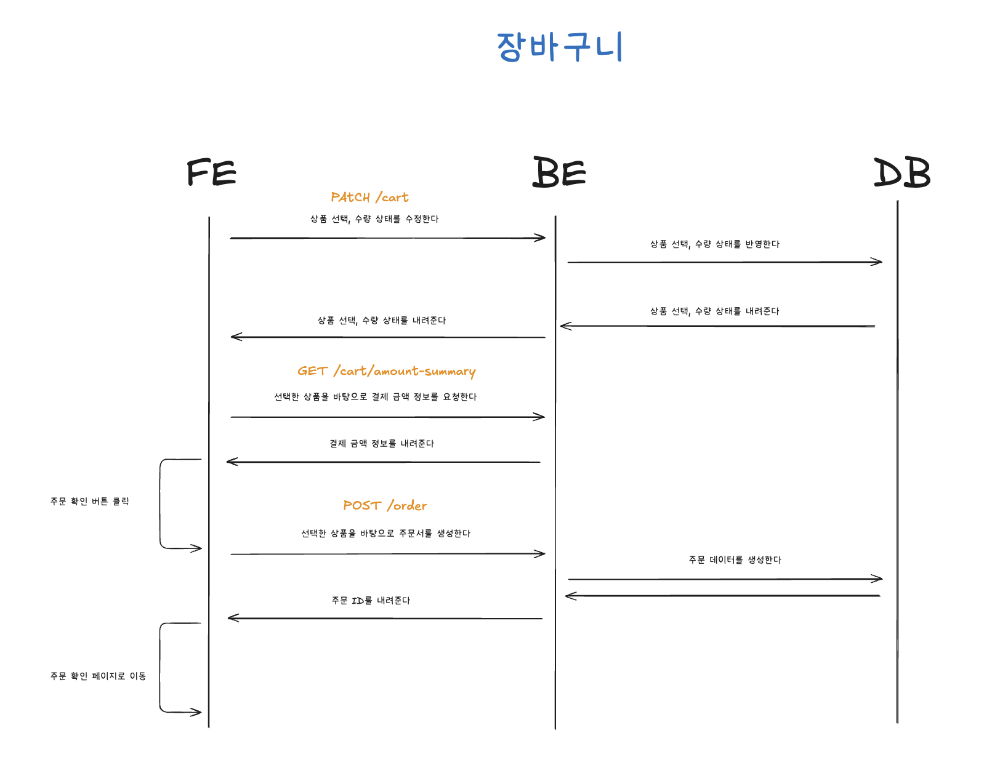
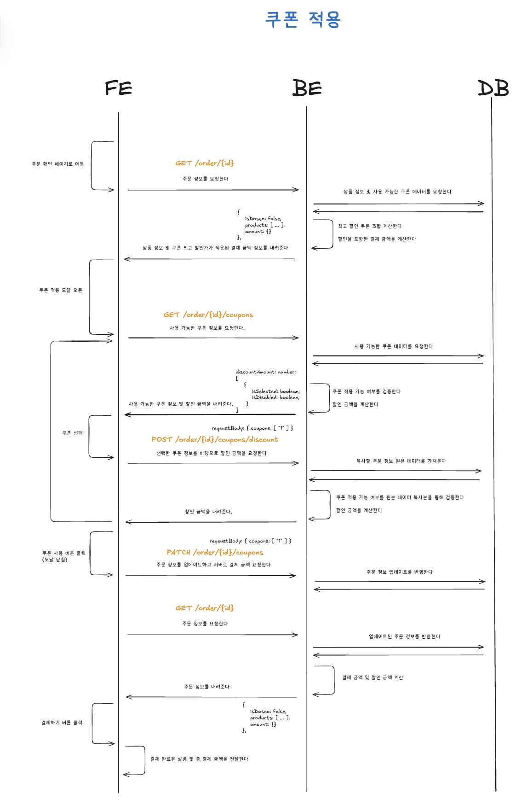
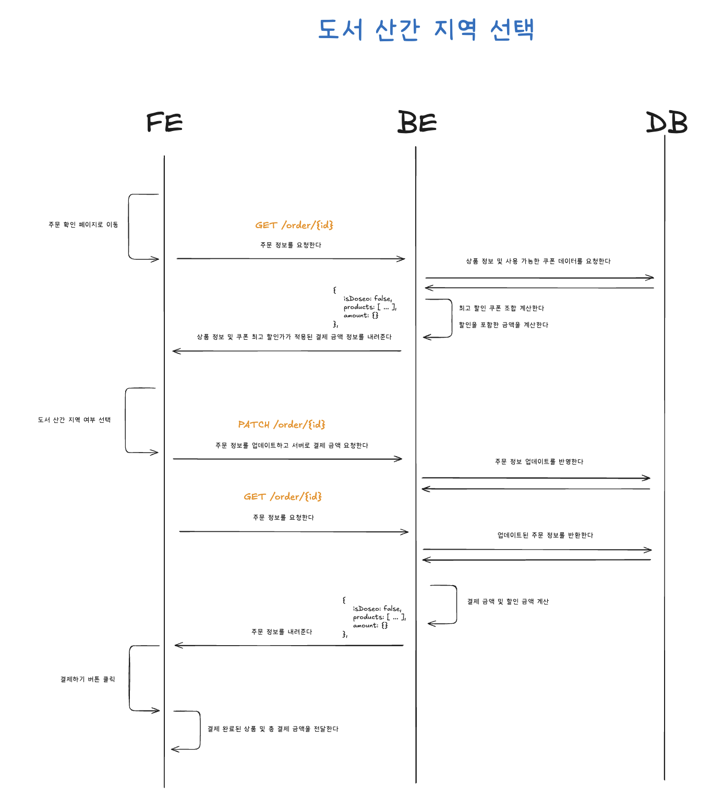

# 시스템 설계

## 시퀀스 다이어그램

### 장바구니 페이지

장바구니 페이지에서는 사용자가 상품 선택 상태나 수량을 변경하면 프론트엔드가 백엔드에 장바구니 상태 수정을 요청한다. 백엔드는 요청받은 상품 선택 여부와 수량 정보를 데이터베이스에 반영한 뒤, 변경된 장바구니 상태를 응답한다.

프론트엔드는 선택된 상품 정보를 기준으로 결제 금액 요약 정보를 요청한다. 백엔드는 선택된 상품 목록을 바탕으로 주문 금액을 계산해 반환하고, 프론트엔드는 이를 장바구니 페이지의 결제 금액 영역에 표시한다.

사용자가 `주문 확인` 버튼을 클릭하면 프론트엔드는 현재 선택된 상품을 기준으로 주문 생성을 요청한다. 백엔드는 주문 데이터를 생성하고 주문 ID를 반환한다. 프론트엔드는 반환받은 주문 ID를 이용해 주문 확인 페이지로 이동한다.

### 주문 확인 페이지 - 쿠폰 모달

주문 확인 페이지에 진입하면 프론트엔드는 주문 ID를 기준으로 주문 정보를 요청한다. 백엔드는 주문 상품 정보, 도서 산간 지역 여부, 결제 금액 정보를 조회하고, 사용 가능한 쿠폰 데이터를 함께 확인한다. 이후 가장 할인 금액이 큰 쿠폰 조합을 계산해 기본 적용된 결제 금액 정보를 반환한다.

사용자가 쿠폰 적용 모달을 열면 프론트엔드는 해당 주문에 사용할 수 있는 쿠폰 목록을 요청한다. 백엔드는 주문 상품 정보와 쿠폰 조건을 기준으로 각 쿠폰의 사용 가능 여부를 검증하고, 쿠폰별 선택 가능 상태와 할인 금액 정보를 반환한다.

사용자가 쿠폰을 선택하면 프론트엔드는 선택된 쿠폰 정보를 바탕으로 할인 금액 계산을 요청한다. 백엔드는 주문 데이터 원본을 기준으로 쿠폰 적용 가능 여부를 다시 검증한 뒤 할인 금액을 계산해 반환한다. 사용자가 쿠폰 사용을 확정하면 프론트엔드는 선택된 쿠폰 정보를 주문에 반영하도록 요청하고, 백엔드는 주문 정보를 업데이트한다.

이후 프론트엔드는 갱신된 주문 정보를 다시 조회해 쿠폰 할인 금액과 최종 결제 금액을 화면에 반영한다. 사용자가 결제하기 버튼을 클릭하면 프론트엔드는 결제 완료된 상품 및 총 결제 금액 정보를 전달한다.

### 주문 확인 페이지 - 도서 산간 지역 선택

주문 확인 페이지에 진입하면 프론트엔드는 주문 ID를 기준으로 주문 정보를 요청한다. 백엔드는 주문 상품 정보, 도서 산간 지역 여부, 결제 금액 정보를 조회하고, 적용 가능한 쿠폰과 할인 금액을 계산해 반환한다.

사용자가 도서 산간 지역 여부를 변경하면 프론트엔드는 변경된 배송지 정보를 주문 정보에 반영하도록 요청한다. 백엔드는 주문 데이터의 도서 산간 지역 여부를 업데이트하고, 변경된 주문 정보를 저장한다.

프론트엔드는 업데이트 이후 주문 정보를 다시 조회한다. 백엔드는 변경된 도서 산간 지역 여부를 기준으로 배송비, 할인 금액, 최종 결제 금액을 다시 계산해 반환한다. 프론트엔드는 응답받은 주문 정보를 화면에 반영한다.

사용자가 결제하기 버튼을 클릭하면 프론트엔드는 결제 완료된 상품 정보와 총 결제 금액을 전달한다.
